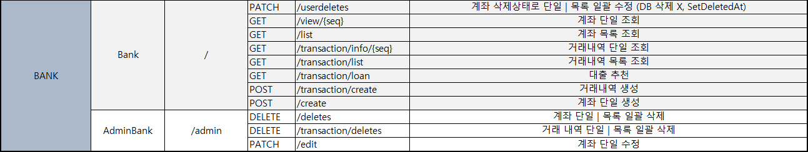
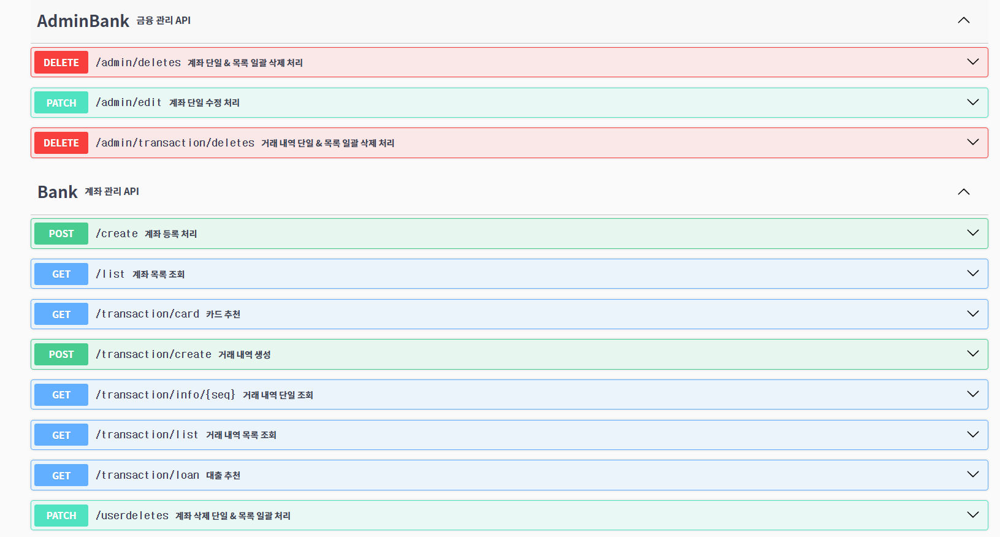
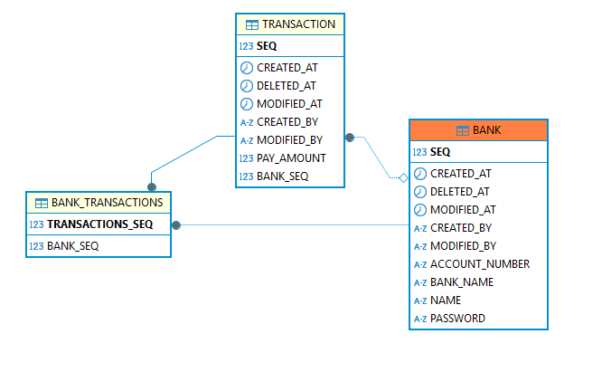

  

# AnonymousCIS 프로젝트

# 기능 명세서

## 🔹 도메인 URL 설계 🔹

## 🔹 관리자 페이지 🔹
- 계좌 단일 | 목록 일괄 삭제			
- 거래 내역 단일 | 목록 일괄 삭제			
- 계좌 단일 수정

## 🔹 사용자(회원) 페이지 🔹
- 계좌 삭제상태로 단일 | 목록 일괄 수정 (DB 삭제 X, SetDeletedAt)			
- 계좌 단일 조회			
- 계좌 목록 조회			
- 거래내역 단일 조회			
- 거래내역 목록 조회			
- 대출 추천			
- 거래내역 생성			
- 계좌 단일 생성

## 🔹 Swagger API 🔹
- 링크 : https://cis-bank-service.onedu.blue/apidocs.html

  

# ERD 작성 (엔티티 관계도)

# BANK
| 키  | 논리      | 물리             | 도메인           | 타입      | Length | UNIQUE | NULL허용 | 기본값     |
|:--:|---------|----------------|---------------|---------|--------|--------|--------|---------|
| pk | 계좌 번호   | SEQ            | Long          | NUMBER  |        |        | N      |         |
|    | 은행명     | BANK_NAME      | BankName      | ENUM    | 50     |        | N      |         |       |
|    | 계좌 번호   | ACCOUNT_NUMBER | String        | VARCHAR | 50     |        | N      |         |  |
|    | 계좌 비밀번호 | PASSWORD       | String        | VARCHAR | 50     |        | N      |         |       |
|    | 예금주 이름  | NAME           | String        | VARCHAR | 30     |        | N      |         |       |
|    | 거래 내역   | TRANSACTIONS   | Transaction   | ENTITY  |        |        | Y      |         |
|    | 생성자     | CREATED_BY     | String        | VARCHAR | 60     |        | Y      |         |       |
|    | 수정자     | MODIFIED_BY    | String        | VARCHAR | 60     |        | Y      |         |       |
|    | 등록일시    | CREATEDAT      | LocalDateTime | DATE    |        |        |        | SYSDATE |
|    | 수정일시    | MODIFIEDAT     | LocalDateTime | DATE    |        |        |        | SYSDATE |
|    | 삭제일시    | DELETEDAT      | LocalDateTime | DATE    |        |        |        | SYSDATE |

# Transaction

| 키  | 논리    | 물리          | 도메인           | 타입      | Length | UNIQUE | NULL허용 | 기본값     |
|:--:|-------|-------------|---------------|---------|--------|--------|--------|---------|
| pk | 지불 번호 | SEQ         | Long          | NUMBER  |        |        | N      |         |
|    | 지불 금액 | 	PAY_AMOUNT | Long          | NUMBER  | 15     |        | N      |         |       |
|    | 지불 계좌 | BANK        | Bank          | ENTITY  |        |        | N      |         |  |
|    | 생성자   | CREATED_BY  | String        | VARCHAR | 60     |        | Y      |         |       |
|    | 수정자   | MODIFIED_BY | String        | VARCHAR | 60     |        | Y      |         |       |
|    | 등록일시  | CREATEDAT   | LocalDateTime | DATE    |        |        |        | SYSDATE |
|    | 수정일시  | MODIFIEDAT  | LocalDateTime | DATE    |        |        |        | SYSDATE |
|    | 삭제일시  | DELETEDAT   | LocalDateTime | DATE    |        |        |        | SYSDATE |
